# User Stories — AI-Powered Secure File Platform (Minimal Scope)

> **Project:** AI-Powered Secure File Web Platform with Malware Detection  
> **Scope:** Minimal, buildable core — upload → scan → quarantine/approve → report, with basic auth and roles.  
> **Out of scope (removed):** email verification, token/link expiry, and file-sharing links.

---

## Table of Contents

1. [Scope Changes](#scope-changes)
2. [System Overview Diagram](#system-overview-diagram)
3. [Use Case Diagram](#use-case-diagram)
4. [Release Overview](#release-overview)
5. [US-1.0.0.0 — User Registration](#us-1000--user-registration)
6. [US-2.0.0.0 — User Login](#us-2000--user-login)
7. [US-3.0.0.0 — File Upload](#us-3000--file-upload)
8. [US-4.0.0.0 — Automatic Malware Scan](#us-4000--automatic-malware-scan)
9. [US-5.0.0.0 — Automatic Quarantine](#us-5000--automatic-quarantine)
10. [US-6.0.0.0 — Security Report](#us-6000--security-report)
11. [US-7.0.0.0 — File Download](#us-7000--file-download)
12. [US-8.0.0.0 — Admin Quarantine Review](#us-8000--admin-quarantine-review)
13. [US-9.0.0.0 — Basic Audit Log](#us-9000--basic-audit-log)
14. [End-to-End Flow](#end-to-end-flow)
15. [File Lifecycle](#file-lifecycle)
16. [Role × Feature Matrix](#role--feature-matrix)
17. [Story Priority Summary](#story-priority-summary)

---

## Scope Changes

| Removed | Why it is gone |
|---------|----------------|
| Email verification | Accounts are created **active** on register. No verification email, no inactive state, no verification link. |
| Expiry | No JWT expiry requirement, no expired-token login flow, no time-limited tokens or links. |
| File sharing links | Users only access **their own** files. No share URLs, no recipients, no collaboration via links. |

Former **US-8.0.0.0 — File Sharing Link** is dropped. Admin review and audit log are renumbered as **US-8** and **US-9**.

---

## System Overview Diagram

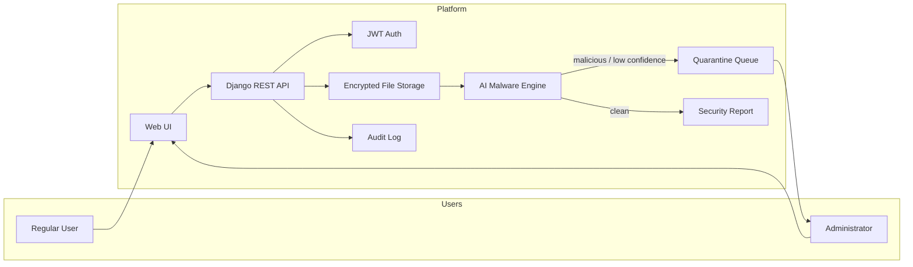

---

## Use Case Diagram

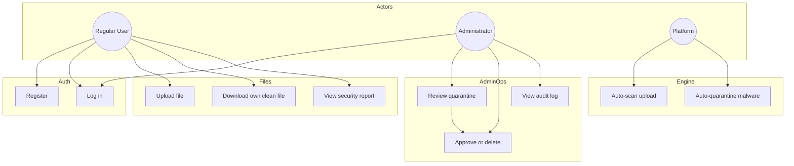

---

## Release Overview

| ID | Story | Priority | Depends On |
|----|-------|----------|------------|
| **US-1.0.0.0** | User Registration | Must-have | — |
| **US-2.0.0.0** | User Login | Must-have | US-1 |
| **US-3.0.0.0** | File Upload | Must-have | US-2 |
| **US-4.0.0.0** | Automatic Malware Scan | Must-have | US-3 |
| **US-5.0.0.0** | Automatic Quarantine | Must-have | US-4 |
| **US-6.0.0.0** | Security Report | Should-have | US-4 |
| **US-7.0.0.0** | File Download | Must-have | US-4, US-5 |
| **US-8.0.0.0** | Admin Quarantine Review | Should-have | US-2, US-5 |
| **US-9.0.0.0** | Basic Audit Log | Could-have | US-3, US-4, US-8 |

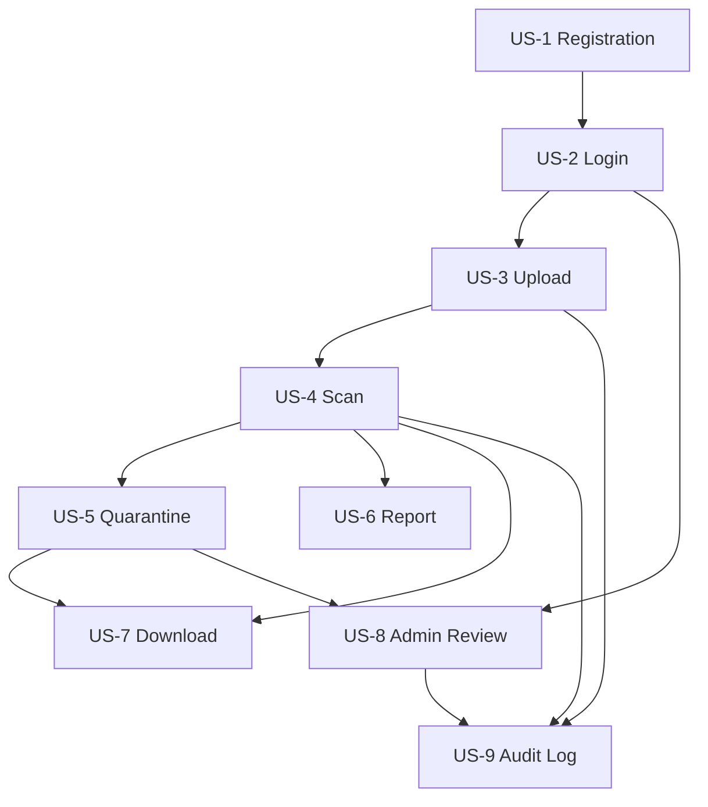

---

## US-1.0.0.0 — User Registration

**As a** new user  
**I want to** register with my email and a password  
**So that** I can create an account and access the platform immediately

### Acceptance Criteria

- Given a valid email and a password meeting minimum strength rules, when I submit the registration form, then my account is created in an **active** state and I can log in right away.
- Given I try to register with an email already in use, when I submit, then I see a clear error and no duplicate account is created.
- Passwords are stored with a one-way hash (bcrypt). The account does **not** wait for email verification.

**Priority:** Must-have

### Flow

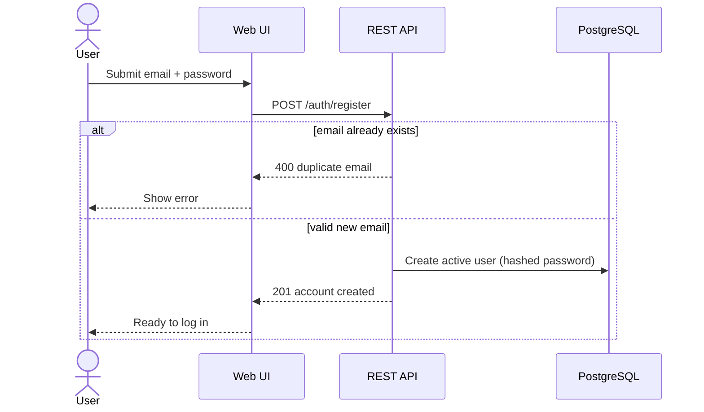

---

## US-2.0.0.0 — User Login

**As a** registered user  
**I want to** log in with my email and password  
**So that** I can securely access my files

### Acceptance Criteria

- Given valid credentials, when I log in, then I receive a JWT access token and can call protected endpoints.
- Given an invalid token, when I call any protected endpoint, then I receive a 401 and am prompted to log in again.
- Given 5 failed login attempts in a short window, when I try again, then the system throttles further attempts (basic rate limiting).
- Tokens are **not** required to expire. Session remains valid until logout or token revocation.

**Priority:** Must-have

### Flow

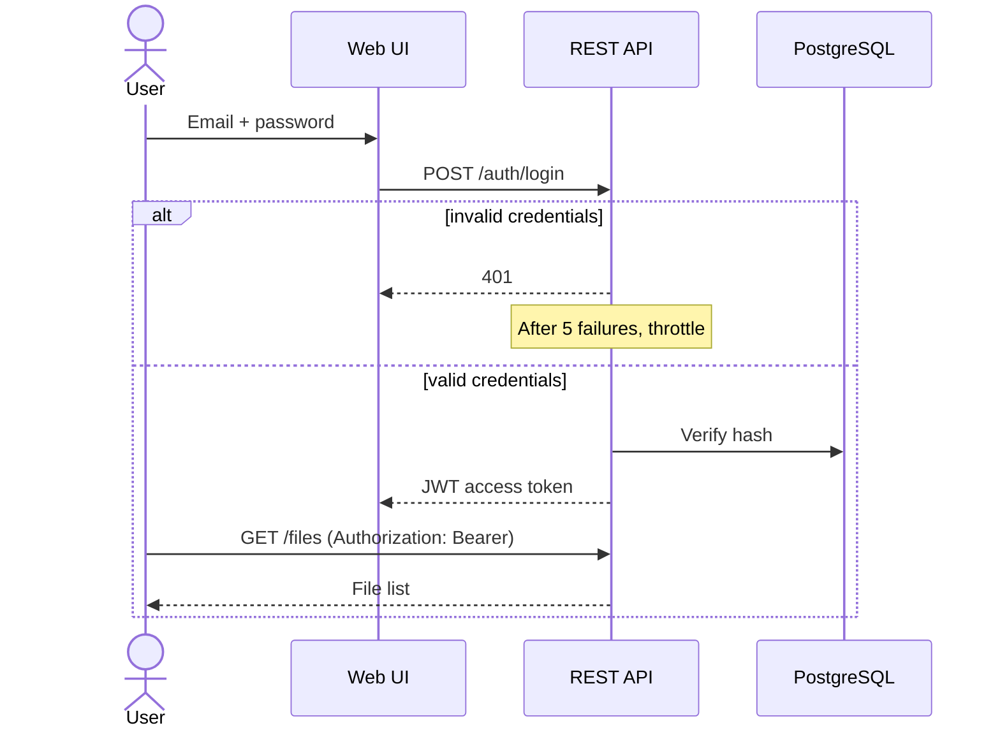

---

## US-3.0.0.0 — File Upload

**As a** logged-in user  
**I want to** upload a file through a simple drag-and-drop interface  
**So that** I can store it on the platform

### Acceptance Criteria

- Given I am logged in, when I drop a file (up to a minimal cap, e.g. 25 MB for the prototype) onto the upload area, then it uploads and shows a progress indicator.
- Given the upload completes, when I check the file’s status, then it shows **Scanning** until the AI engine returns a result.
- Given an unsupported or empty file, when I try to upload it, then I see a clear validation error before upload starts.

**Priority:** Must-have

### Flow

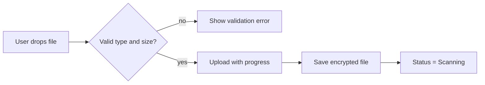

---

## US-4.0.0.0 — Automatic Malware Scan

**As a** platform (system behavior, on behalf of all users)  
**I want** every uploaded file to be automatically scanned by the AI model  
**So that** malicious files never become accessible before being checked

### Acceptance Criteria

- Given a file finishes uploading, when the scan pipeline runs, then it returns a classification (**clean** / **malicious**) with a confidence score.
- Given the scan is in progress, when the owner tries to download the file, then access is blocked until the result is available.
- Given the model cannot confidently classify a file, when the confidence score is below a set threshold, then the file is treated as suspicious and quarantined by default (fail-safe).

**Priority:** Must-have

### Flow

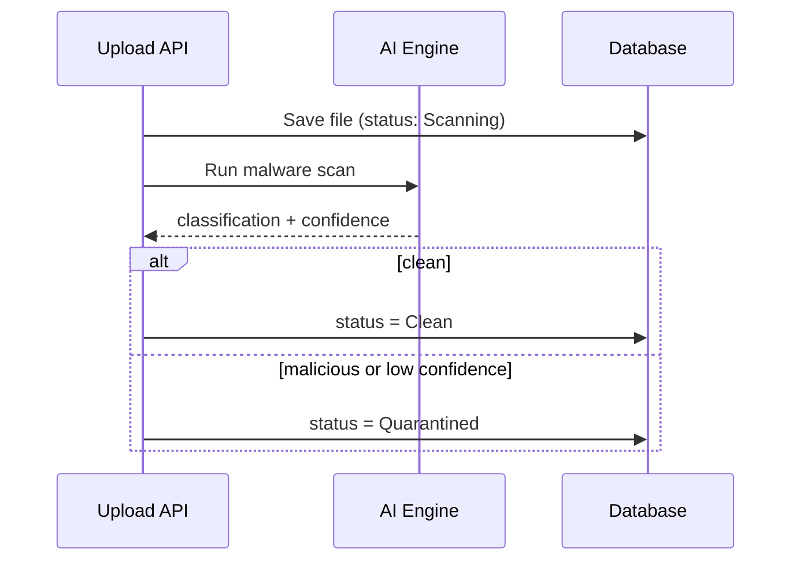

---

## US-5.0.0.0 — Automatic Quarantine

**As a** platform (system behavior)  
**I want** files classified as malicious to be quarantined immediately  
**So that** they cannot be downloaded before an admin reviews them

### Acceptance Criteria

- Given a file is classified malicious, when the scan completes, then the file is moved to a quarantine state and hidden from normal listings.
- Given a file is quarantined, when a regular user tries to download it, then the action is denied with a clear message.
- Given a file is quarantined, when an admin opens the quarantine queue, then it appears with its scan result.

**Priority:** Must-have

### Flow

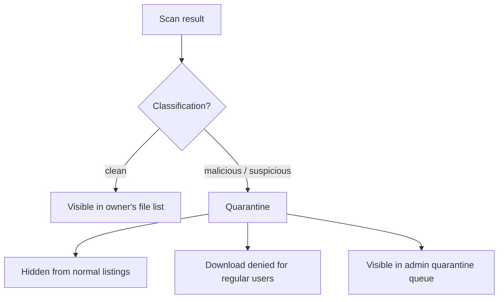

---

## US-6.0.0.0 — Security Report

**As a** user  
**I want to** see a simple, readable report for each scanned file  
**So that** I understand why it was marked clean or malicious

### Acceptance Criteria

- Given a file has been scanned, when I open its details, then I see the classification, confidence score, and scan timestamp.
- Given a file is malicious, when I view the report, then I see a short plain-language explanation of the top reasons it was flagged (simplified feature list — full SHAP explainability deferred).
- Given a file is clean, when I view the report, then it clearly states no threats were found.

**Priority:** Should-have

### Report contents

| Field | Example (malicious) | Example (clean) |
|-------|---------------------|-----------------|
| Classification | Malicious | Clean |
| Confidence | 97.3% | 99.1% |
| Timestamp | 2026-08-18 17:54 UTC | 2026-08-18 17:54 UTC |
| Explanation | Unusual import table; high-entropy section | No threats were found |

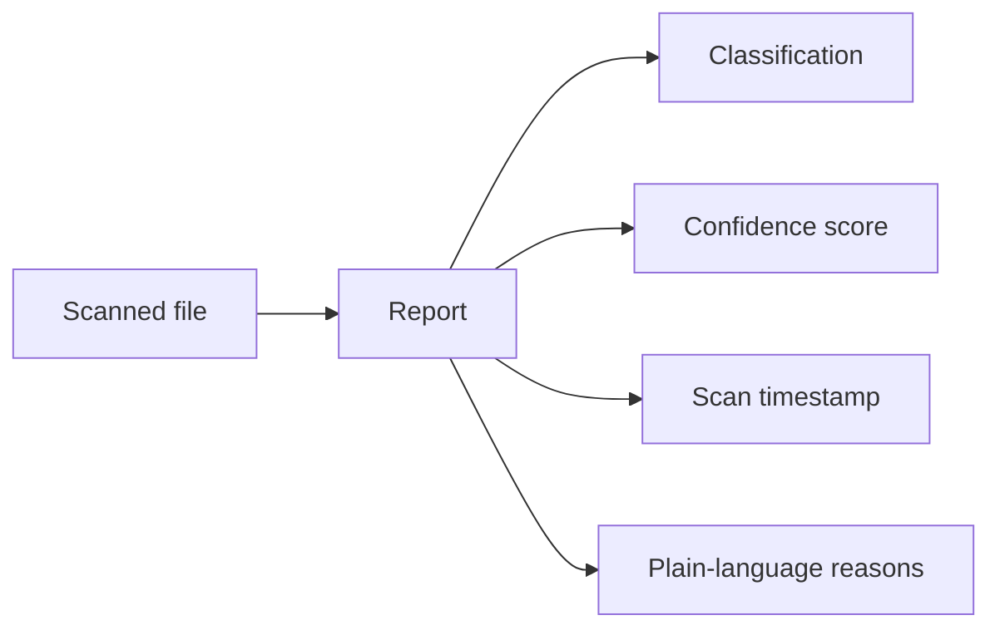

---

## US-7.0.0.0 — File Download

**As a** user  
**I want to** download files that passed the scan  
**So that** I can use the content I uploaded

### Acceptance Criteria

- Given a file is marked clean **and I own it**, when I click download, then the file downloads successfully.
- Given a file is quarantined or still scanning, when I try to download it, then the download is blocked with an explanatory message.
- Given I don’t own the file, when I try to access it, then I receive a permissions error.

**Priority:** Must-have

### Flow

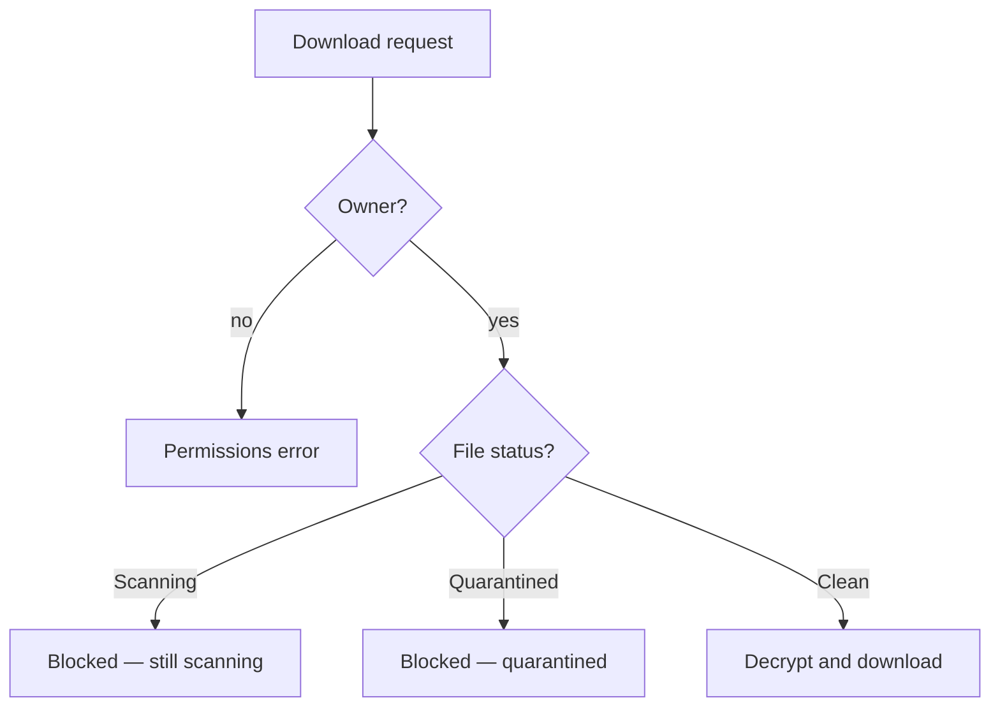

---

## US-8.0.0.0 — Admin Quarantine Review

**As an** administrator  
**I want to** review quarantined files and approve or delete them  
**So that** false positives can be released and confirmed threats removed

### Acceptance Criteria

- Given I am logged in as admin, when I open the quarantine queue, then I see all quarantined files with their scan results.
- Given I approve a quarantined file, when I confirm the action, then it becomes available to its owner like a normal clean file.
- Given I reject a quarantined file, when I confirm deletion, then the file and its content are permanently removed.

**Priority:** Should-have

### Flow

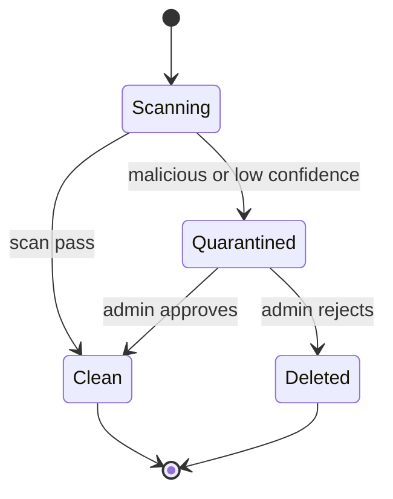

---

## US-9.0.0.0 — Basic Audit Log

**As an** administrator  
**I want** a simple log of upload, scan, and quarantine-decision events  
**So that** I can trace what happened to any file on the platform

### Acceptance Criteria

- Given any upload, scan result, or admin decision occurs, when it happens, then an entry is recorded with user, action, file, and timestamp.
- Given I am an admin, when I open the audit log, then I can filter it by user or by file.
- Given a log entry is created, when any user (including admin) tries to edit or delete it, then the system prevents it (append-only).

**Priority:** Could-have (minimal version — full 12-month retention/reporting deferred)

### Events logged

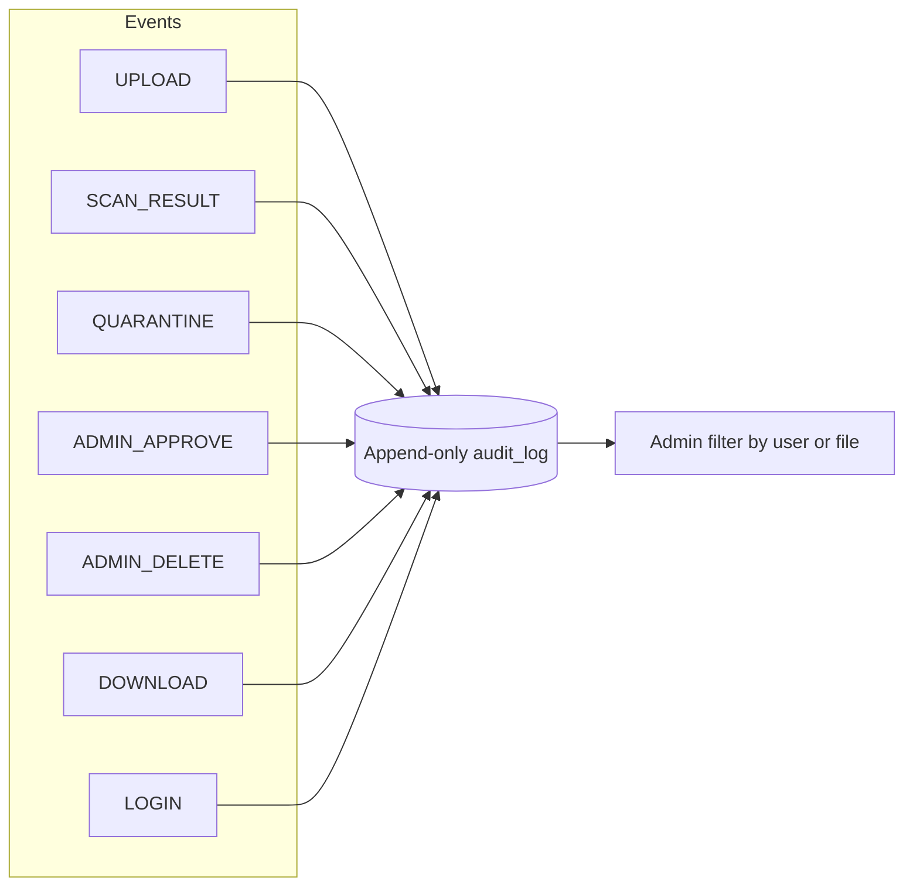

| Column | Description |
|--------|-------------|
| `id` | UUID |
| `timestamp` | UTC, immutable |
| `actor_id` | User or system |
| `action` | UPLOAD, SCAN_RESULT, QUARANTINE, APPROVE, DELETE, DOWNLOAD, LOGIN |
| `file_id` | Target file when applicable |
| `metadata` | JSON — classification, confidence, etc. |

---

## End-to-End Flow

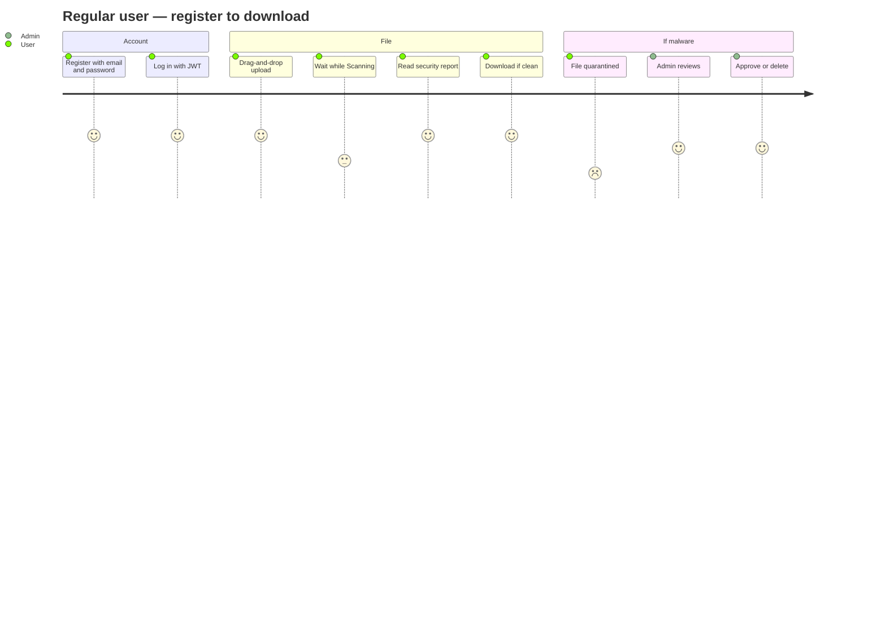

---

## File Lifecycle

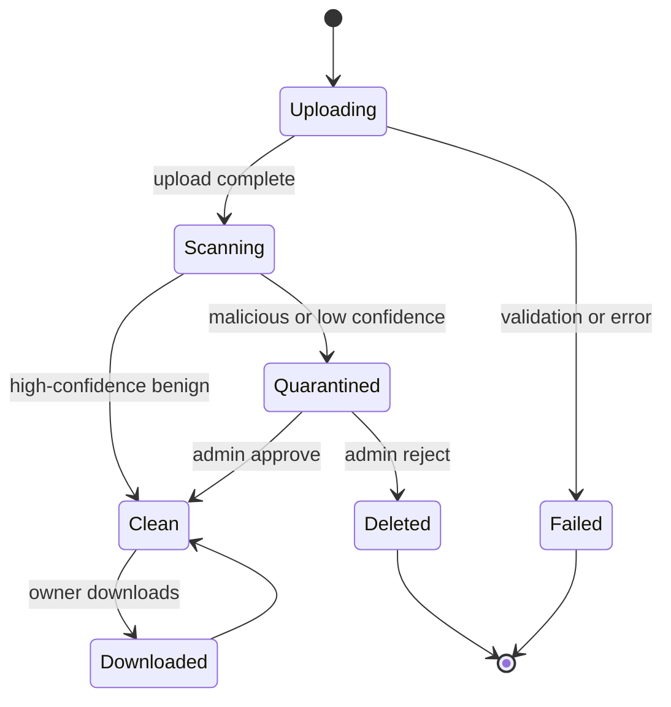

---

## Role × Feature Matrix

| Feature | Regular User | Administrator |
|---------|:------------:|:-------------:|
| Register / log in | ✓ | ✓ |
| Upload files | ✓ | ✓ |
| View own security reports | ✓ | ✓ |
| Download own clean files | ✓ | ✓ |
| Create share links | — | — |
| Review quarantine queue | — | ✓ |
| Approve / delete quarantined files | — | ✓ |
| View / filter audit log | — | ✓ |

---

## Story Priority Summary

| ID | Story | Priority |
|----|-------|----------|
| US-1.0.0.0 | User Registration | Must-have |
| US-2.0.0.0 | User Login | Must-have |
| US-3.0.0.0 | File Upload | Must-have |
| US-4.0.0.0 | Automatic Malware Scan | Must-have |
| US-5.0.0.0 | Automatic Quarantine | Must-have |
| US-6.0.0.0 | Security Report | Should-have |
| US-7.0.0.0 | File Download | Must-have |
| US-8.0.0.0 | Admin Quarantine Review | Should-have |
| US-9.0.0.0 | Basic Audit Log | Could-have |

**MVP cut line:** US-1 through US-7 form the smallest end-to-end loop (register → login → upload → scan → quarantine → report → download). US-8 and US-9 add admin control and traceability.

**Dropped from the original PDF:** US-8 File Sharing Link (time-limited links, expiry, collaboration).

---

*Updated from User_Stories_Minimal_Project.pdf — August 2026*
